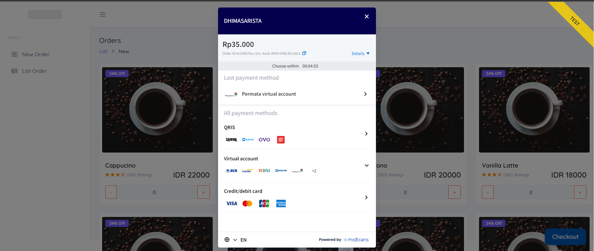
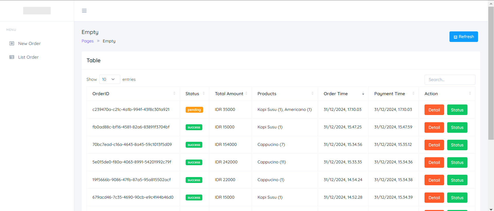

# Go Go Power Ranger



- **Web Framework**: Golang Fiber.
- **Go Project Layout**: Cobra
- **Configuration**: Viper
- **Template Engine**: Mustache.
- **DBMS**: Maisequel.
- **Midtrans**: Payment Gateway Service.
- **SocketIO**: Real-Time Response.
- **Design Pattern**: Repository, Service, Model.
- **Dependency Injection**:

> Note: Fasthttp engine perlu di brige ke http menggunakan adaptor biar socketio bisa digunakan

> Run App: go run main.go engine start



## SQL

```sql
-- Tabel Products
CREATE TABLE IF NOT EXISTS `products` (
    `id` CHAR(36) NOT NULL PRIMARY KEY DEFAULT (UUID()),
    `name` VARCHAR(255) NOT NULL,
    `price` INT(11) NOT NULL,
    `created_at` TIMESTAMP NOT NULL DEFAULT CURRENT_TIMESTAMP(),
    `updated_at` TIMESTAMP NOT NULL DEFAULT CURRENT_TIMESTAMP() ON UPDATE CURRENT_TIMESTAMP()
);

-- Tabel Orders
CREATE TABLE IF NOT EXISTS `orders` (
    `id` CHAR(36) NOT NULL PRIMARY KEY DEFAULT (UUID()),
    `status` VARCHAR(255) NOT NULL DEFAULT 'pending',
    `total_amount` INT(11) NOT NULL,
    `transaction_token` VARCHAR(255) NOT NULL,
    `created_at` TIMESTAMP NOT NULL DEFAULT CURRENT_TIMESTAMP(),
    `updated_at` TIMESTAMP NOT NULL DEFAULT CURRENT_TIMESTAMP() ON UPDATE CURRENT_TIMESTAMP()
);

-- Tabel Order Items
CREATE TABLE IF NOT EXISTS `order_items` (
    `id` CHAR(36) NOT NULL PRIMARY KEY DEFAULT (UUID()),
    `order_id` CHAR(36) DEFAULT NULL,
    `product_id` CHAR(36) DEFAULT NULL,
    `quantity` INT(11) NOT NULL,
    `amount` INT(11) NOT NULL,
    `created_at` TIMESTAMP NOT NULL DEFAULT CURRENT_TIMESTAMP(),
    `updated_at` TIMESTAMP NOT NULL DEFAULT CURRENT_TIMESTAMP() ON UPDATE CURRENT_TIMESTAMP(),
    FOREIGN KEY (`order_id`) REFERENCES `orders`(`id`) ON DELETE CASCADE,
    FOREIGN KEY (`product_id`) REFERENCES `products`(`id`) ON DELETE CASCADE
);

```
